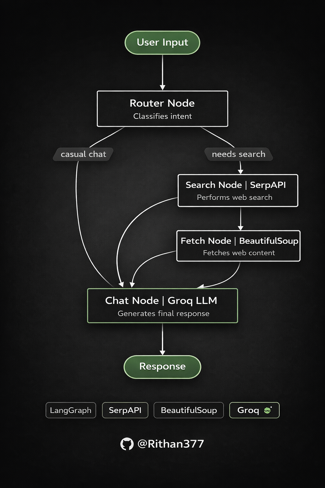

# QueryRouter-AI

QueryRouter-AI is a modular AI application that routes user queries to the most appropriate processing path (LLM, search, or hybrid) using a graph-based workflow.  
It is built using **LangGraph**, **Groq LLMs**,**Serp API** and **Streamlit** for an interactive UI.

The goal of this project is to demonstrate **structured LLM orchestration** instead of single-call prompt handling.

---

## Key Features

- Query routing using **LangGraph**
- Modular node-based execution flow
- Groq-powered LLM inference
- Optional search + fetch pipeline powered by Serp API
- Streamlit-based web interface
- Clean, reproducible Python setup

---

## Architecture


The system follows a **graph-based execution model**:

1. **User Query**
2. **Router Node**
   - Decides how the query should be handled
3. **Execution Path**
   - LLM-only response  
   - Search + fetch + LLM response
4. **Final Answer Returned to UI**

This avoids monolithic prompt logic and makes the system easier to extend and debug.

---

## Project Structure

QueryRouter-AI/
│
├── ui.py # Streamlit UI
├── Groq.py # LangGraph construction and execution
├── Search_fetch.py # Search and data fetching logic
├── flow.png # Architecture diagram
├── docker-compose.yml # Container setup (optional)
├── requirement.txt # Python dependencies
├── .gitignore
└── README.md


---

## Requirements

- Python **3.10**
- Groq API key
- Serp API key
- Internet access (for search, if enabled)

---

## Setup Instructions

## Getting Started

Clone the repository and move into the project directory:

```bash
git clone https://github.com/Rithan377/QueryRouter-AI.git
cd QueryRouter-AI

python3.10 -m venv venv
source venv/bin/activate

pip install -r requirement.txt

The system is built using a graph-based execution model with an explicitly defined LangGraph entry point, ensuring predictable and debuggable execution flow. The project is compatible with LangGraph version 0.0.55 and above, and relies on LangChain Core 0.2.x APIs. Python 3.10 is recommended for stable behavior across all components. API usage may incur costs depending on the Groq plan associated with your API key.

This design emphasizes explicit routing over prompt-based guessing, making execution paths transparent and easier to debug. The graph-based approach enables independent testing of nodes and allows new tools or execution routes to be introduced without breaking existing logic. As a result, the architecture aligns more closely with production-oriented LLM systems rather than simple demonstration applications.

Planned improvements include more advanced routing strategies, memory-aware query handling, integration with vector databases, support for API-only (headless) deployments, and automated evaluation and observability tooling.

This project is intended for learning, experimentation, and prototyping purposes. It should not be considered a drop-in production system without additional testing, security reviews, and operational hardening.